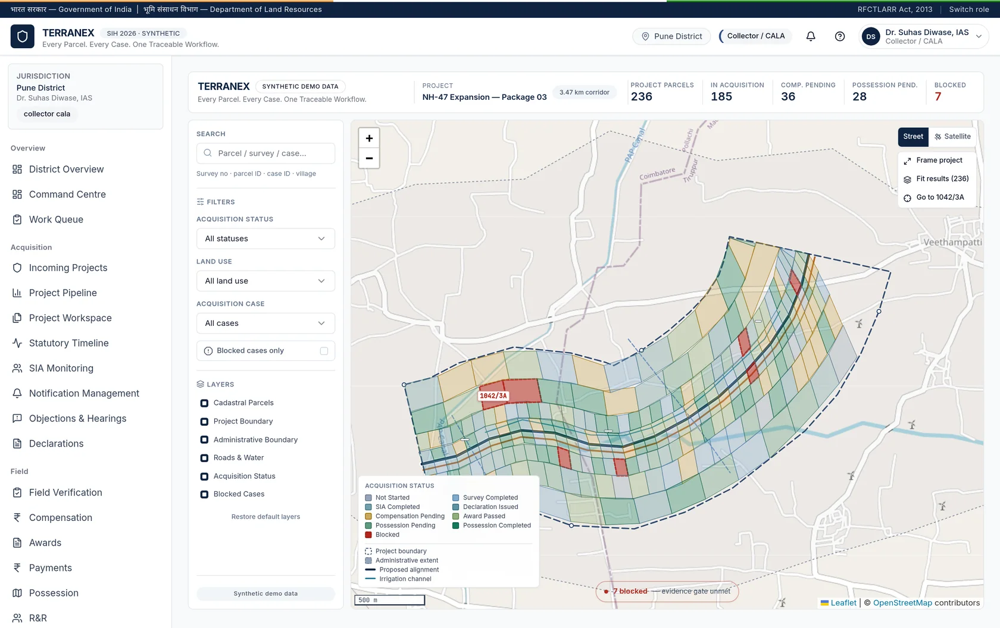
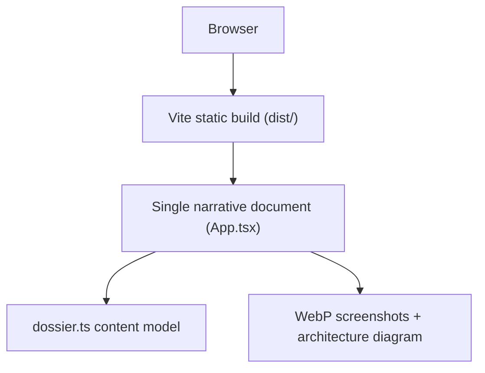

# Terranex — Interactive Product Dossier

> A GIS-based case management platform that connects land parcels, statutory stages, documents, compensation and rehabilitation into one traceable acquisition record.

Terranex is a parcel-centric orchestration concept for land acquisition under the RFCTLARR Act, 2013 (SIH 2026 · Problem Statement 26016 · Department of Land Resources). This repository is its **judge-facing information site**: a single-page, interactive product dossier that explains the problem, the system, and — with an explicit honesty boundary — what is a working frontend prototype versus what is planned target implementation.

**No backend. No API calls. No government system connections.** Every parcel, owner, amount, and event shown is synthetic demonstration data.



## Contents

- [What this is](#what-this-is)
- [Status model](#status-model)
- [Tech stack](#tech-stack)
- [Project structure](#project-structure)
- [Requirements](#requirements)
- [Quick start](#quick-start)
- [Available commands](#available-commands)
- [Design system](#design-system)
- [Content model](#content-model)
- [Deployment](#deployment)
- [Limitations](#limitations)
- [Roadmap](#roadmap)
- [License](#license)

## What this is

Land acquisition under the RFCTLARR Act passes through **17 statutory stages, 6 tiers of office, and multiple disconnected record systems**. The site walks a reviewer through that reality in reading order:

**Problem → Solution → GIS → Cases → Documents → Workflow → Traceability → Auditability → Field → Architecture → Security → Prototype status → Roadmap → Vision**

Key sections:

| Section | What it shows |
| --- | --- |
| Hero | Dark-navy introduction, GIS workstation screenshot, acquisition backbone chain |
| Problem | Scale metrics (17 stages, 6 tiers, multiple systems, 1 case) + fragmentation analysis |
| GIS / Cases / Documents | Real prototype screens with parcel, case-register, and vault captures |
| Workflow | 10-step end-to-end acquisition journey with role attribution |
| Architecture | Target-system diagram + layer stack with per-layer status |
| Prototype status | Capability matrix, Current Prototype vs Target Implementation, deliberate non-goals |
| Roadmap | Prototype → MVP → Pilot → Integration → Scale |

All copy lives in [`src/data/dossier.ts`](src/data/dossier.ts). All 18 content sections live in [`src/sections/`](src/sections/), one file per section, rendered in order by [`src/App.tsx`](src/App.tsx).

## Status model

This is the site's core editorial rule, enforced structurally: every capability claim carries a mandatory `Status`, rendered only through `StatusTag`.

| Label | Meaning |
| --- | --- |
| `PROTOTYPE` | Running in the frontend prototype today |
| `DEMONSTRATION` | Rendered with synthetic data, not government records |
| `PLANNED` | Designed and scoped, not yet connected |
| `TARGET WORKFLOW` | Intended production behaviour of the screen |

No security certification, throughput figure, or percentage improvement is claimed anywhere on the site.

## Tech stack

| Layer | Technology | Purpose |
| --- | --- | --- |
| Framework | React 18 + TypeScript + Vite 5 | Single-page dossier, no router |
| Styling | Tailwind CSS 3 | Terranex navy/saffron tokens in `tailwind.config.ts` |
| Icons | Lucide React | UI iconography only |
| Fonts | Inter (body) + JetBrains Mono (eyebrows/metadata/badges) | Google Fonts via `index.html` |
| Images | WebP in `public/screenshots/` (61 files) + `public/architecture/` | Lazy-loaded, intrinsic dimensions, CLS-free |
| Motion | `IntersectionObserver` reveal in `src/components/Reveal.tsx` | Respects `prefers-reduced-motion` |

Deliberately absent: state library, router, animation runtime, backend, database, authentication, API client.



## Project structure

```text
terranex-info-site/
├── index.html                  # Title, meta/OG tags, font links
├── vercel.json                 # Build command, output dir, image caching
├── tailwind.config.ts          # Navy/saffron palette, Inter + JetBrains Mono
├── vite.config.ts              # @ alias, chunk split, dev :3200 / preview :4173
├── public/
│   ├── screenshots/            # 61 WebP captures of the real prototype UI
│   └── architecture/           # Target-system architecture diagram
└── src/
    ├── App.tsx                 # Section order (problem → vision)
    ├── main.tsx                # React entry
    ├── index.css               # Type scale, tricolour rule, reveal utilities
    ├── data/dossier.ts         # All copy + STATUS_META + content model
    ├── components/             # Navbar, Footer, Section, ScreenshotFrame,
    │                           # StatusTag, Reveal, Flow
    └── sections/               # 18 section files in reading order
```

Important components:

- `Section.tsx` — shared section chrome (eyebrow, heading, deck, tone).
- `ScreenshotFrame.tsx` — `BrowserFrame` / `PhoneFrame` evidence frames with status tags.
- `StatusTag.tsx` — the only way a capability is labelled.
- `Navbar.tsx` — sticky nav with scroll-spy and focus-trapped mobile drawer.
- `Flow.tsx` — `FlowChain` / `ConvergeDiagram` for chain and fragmentation visuals.

## Requirements

- **Node.js >= 18** (per `engines` in `package.json`; exact version not pinned)
- **npm** (lockfile: `package-lock.json`)
- No database, Docker, or environment variables required.

## Quick start

```bash
# 1. Clone
git clone <repository-url>
cd terranex-info-site

# 2. Install
npm install

# 3. Start the dev server
npm run dev
```

Open http://localhost:3200.

## Available commands

All verified against `package.json` scripts:

| Command | What it does |
| --- | --- |
| `npm run dev` | Vite dev server on port 3200 (`strictPort`) |
| `npm run build` | `tsc -b` typecheck + Vite production build to `dist/` |
| `npm run preview` | Serve the production build on port 4173 |
| `npm run typecheck` | `tsc -b --noEmit` |
| `npm run lint` | `oxlint` (ignores `dist`, `public`) |

No test runner, formatter, or CI workflow is configured in this repository.

## Design system

Tokens in `tailwind.config.ts` mirror the Terranex prototype: navy `#0F2340`, saffron accent, Inter for human-readable text, JetBrains Mono reserved for eyebrows, metadata, IDs, and status badges.

Two colours were darkened from the prototype palette for WCAG AA compliance:

- `saffron-600` → `#A85A14` (eyebrow text on white)
- `slate-400` → `#64748B` (body-adjacent text on white)

`slate-300` is decorative-only (rules, empty grid cells), never text. Type scale: hero 64–72px / section 44–50px / body 17px+ for projector readability.

## Content model

To add or correct dossier content, edit `src/data/dossier.ts` — sections render from it, so copy changes don't require component edits. Any new capability claim must include a `status` (`prototype` | `demonstration` | `planned` | `target`); see `STATUS_META` for the exact label semantics.

Screenshots are static files under `public/`. Keep WebP format and preserve intrinsic `width`/`height` on `` to avoid layout shift.

## Deployment

Configured for Vercel via `vercel.json`:

- Build command: `npm run build`
- Output directory: `dist`
- Framework preset: `vite`
- `cleanUrls: true`; no rewrites (no client-side routes)
- Immutable long-lived caching for `/screenshots/*` and `/architecture/*`

No environment variables or server-side configuration required. Any static host serving `dist/` works.

## Limitations

- **Frontend only.** No backend, persistent database, authentication, payments, or live GIS/data services.
- **Synthetic data.** All figures, parcel boundaries, survey numbers, owners, and monetary values are demonstration data — none is a government record.
- **Modelled integrations.** DILRMP/ULPIN, state land records, Bhoomi Rashi, PFMS, and PM Gati Shakti appear as an interface-modelled registry with synthetic sync states; no external service is contacted.
- **Security posture.** Role workspaces, jurisdiction scoping, and the audit-ledger interface run in the prototype; server-side authorization, tamper-proof retention, and certification are target-implementation scope (see the Security section disclaimer on the site).
- **No tests or CI.** Verification to date has been manual headless-Chrome checks against `npm run preview` (build/typecheck/lint clean, no overflow, images load, anchors resolve, keyboard/reduced-motion honoured).

## Roadmap

Derived from the site's Roadmap section and `PHASES` in `dossier.ts`. Phases describe sequence, not calendar:

- **Completed — Prototype:** 11 role workspaces, 17-stage case model, GIS/cases/documents/audit interfaces.
- **In progress — MVP:** backend API, PostgreSQL + PostGIS, server-side RBAC, document storage.
- **Planned — Pilot:** single district, real land records, statutory instruments, field officers on device.
- **Planned — Integration:** DILRMP/ULPIN, PFMS, PM Gati Shakti, Bhoomi Rashi reconciliation.
- **Planned — Scale:** multi-district/state rollout, national monitoring, citizen transparency.

## License

No license file is currently present in this repository. All rights are reserved by default until a license is added.
